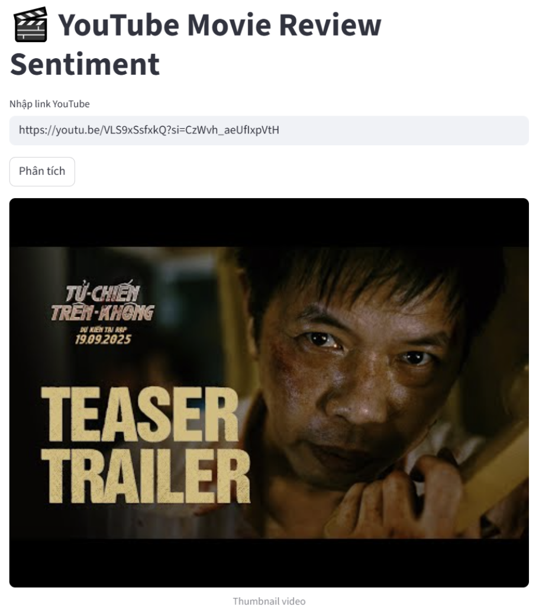
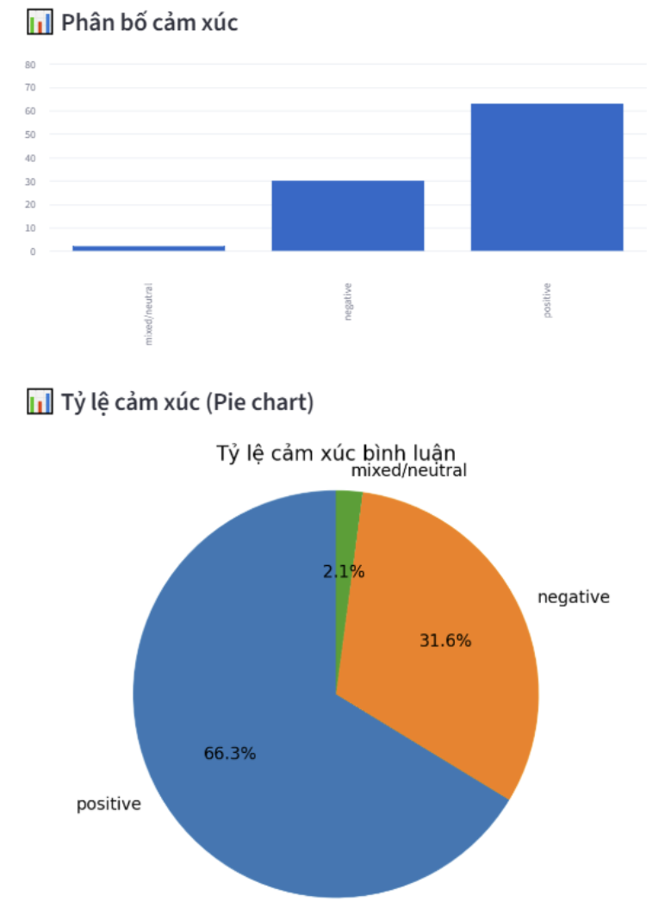
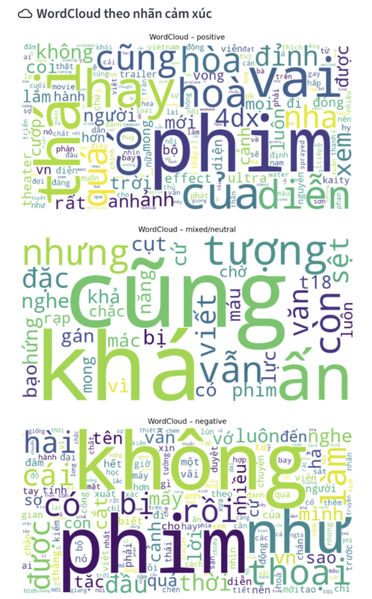
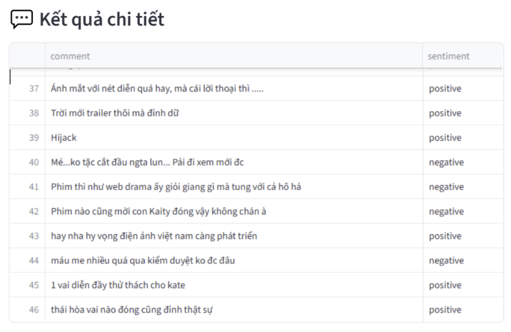

# Project Overview
This project focuses on sentiment analysis for movie reviews collected from the MoMo platform.
The workflow covers the full data science pipeline:
- Web scraping movie data and user comments using Selenium
- Data labeling and preprocessing
- Exploratory Data Analysis (EDA)
- Feature engineering and text vectorization (TF-IDF)
- Training and tuning Machine Learning models
- Building and evaluating Deep Learning models (RNN-based)
- Comparing performance between Machine Learning and Deep Learning approaches

## Tech Stack
- Python
- Selenium (web scraping)
- Pandas, NumPy (data processing)
- Scikit-learn (ML models)
- TensorFlow / PyTorch (Deep Learning models)
- Matplotlib / Seaborn (visualization)

# Project Workflow

1. Data Collection
- Crawl movie data and user comments from MoMo using Selenium
- Extract:
    - Movie information
    - User reviews/comments
    - User ratings

2. Data Labeling
- Assign sentiment labels (e.g., Positive / Negative / Neutral)
- Ensure dataset consistency for supervised learning

3. Data Preprocessing
- Remove stopwords
- Remove emojis and special characters
- Normalize slang and informal language
- Clean and standardize text

4. Exploratory Data Analysis (EDA)
- Analyze sentiment distribution
- Explore word frequency and common phrases
- Identify data imbalance and noise

5. Feature Engineering
- Feature Extraction
    - Create additional features (e.g., comment length, word count)

- Feature Transformation
	- Convert text into numerical representation using TF-IDF

6. Machine Learning Models
- Logistic Regression
- Support Vector Machine (SVM)
- Naive Bayes

✔ Hyperparameter tuning using GridSearchCV

7. Deep Learning Models
- Recurrent Neural Network (RNN)
- Long Short-Term Memory (LSTM)
- Gated Recurrent Unit (GRU)

✔ Train and evaluate using the same dataset and same processing technique

8. Model Evaluation
- F1-Macro

9. Model Comparison
- Compare Machine Learning vs Deep Learning performance
- Analyze strengths and weaknesses of each approach

We also have a UI built with Streamlit for this project

To use this UI, refer to UI_guide.md
# Project Objectives & Key Results (OKRs)

## Objective 1: Collect and Build a High-Quality Movie Review Dataset

Key Results:
- Successfully crawl movie data and comments using Selenium
- Label dataset with clear sentiment categories
- Ensure clean and structured dataset ready for modeling

## Objective 2: Perform Effective Data Preprocessing and EDA

Key Results:
- Clean text data (remove stopwords, emojis, slang)
- Visualize sentiment distribution and key text patterns
- Identify data imbalance and potential noise

## Objective 3: Engineer Meaningful Features for Text Data

Key Results:
- Extract additional features (e.g., comment length)
- Transform text into TF-IDF vectors
- Prepare feature set suitable for ML models

## Objective 4: Develop and Optimize Machine Learning Models

Key Results:
- Train Logistic Regression, SVM, and Naive Bayes models
- Perform hyperparameter tuning using GridSearchCV
- Achieve strong baseline performance across evaluation metrics

## Objective 5: Build and Evaluate Deep Learning Models

Key Results:
- Implement RNN, LSTM, and GRU models
- Train models on the same dataset for fair comparison
- Evaluate using F1-Macro

## Objective 6: Compare ML and Deep Learning Performance

Key Results:
- Compare models across all evaluation metrics
- Identify best-performing model
- Analyze trade-offs:
- Performance vs training complexity
- Simplicity vs representation power

## Objective 7: Derive Insights from Sentiment Analysis

Key Results:
- Identify patterns in positive vs negative reviews
- Understand user sentiment trends toward movies
- Provide insights into model effectiveness on real-world text data